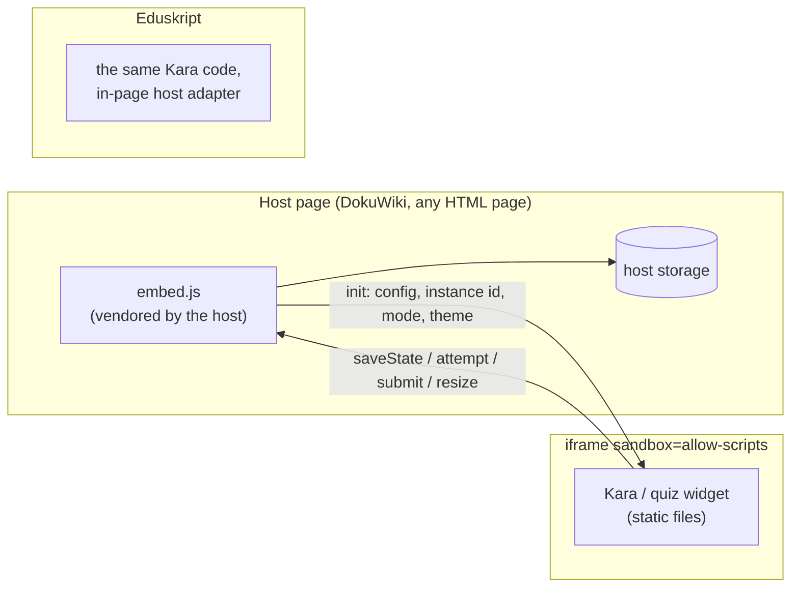

# Proposal: portable learning widgets, with Eduskript as their home

Eduskript's widgets (Kara, quiz questions, later the Python editor and
plugins) could also run on other sites, as static files in a sandboxed
iframe. Eduskript stays the place where they are written, hosted, graded and
tracked.

This is a working prototype, not a pull request. Nothing changes for
Eduskript users unless you want it to.

## Why

**Portable content lowers the hurdle to adopt Eduskript.** A cautious author
can invest in Eduskript content without betting on any one platform: what
they write (markdown plus widget tags) keeps working elsewhere. That reassures
exactly the conservative authors who hesitate today.

It gives away nothing of what makes Eduskript worth using. The interface
leaves everything trusted and valuable to the host by design: identity,
storage and sync, grading, AI feedback, classes, exams, the authoring
experience and the site. A widget on a wiki page is a working exercise
without any of that.

It also works in the other direction: Eduskript can host widgets written
elsewhere (bottom-editor, for example), as an extension of its plugin SDK.

## Try it

The same Kara levels and quiz questions in three hosts:

| Host | Link |
|---|---|
| A plain HTML page | https://bottom.ch/widgets/demo/ |
| DokuWiki | https://bottom.ch/dokuwiki/doku.php?id=learning-widgets |
| Eduskript, natively | https://eduskript.bottom.ch/tom/learning-widgets/kara |

On the HTML page, the box at the bottom shows what the host receives: an
`attempt` for each Kara Run, a `submit` for "Test all worlds" and for each
quiz answer.

## How it works



- **Widgets are static files**, built from Eduskript's own sources
  (`standalone/`, a Vite build next to the Next.js app). Kara and the quiz reuse
  `KaraPanel`, the Kara Python module and `QuestionInner` unchanged.
- **One interface, several transports.** Widget code talks to a small host
  interface. In Eduskript, an in-page adapter maps it onto `userDataService`
  and the existing API, so nothing changes. Elsewhere, `embed.js` speaks a
  postMessage protocol to the iframe.
- **Configured where it is used:**
  ```html
  <learning-widget src="https://bottom.ch/widgets/quiz/" type="multiple" attempts="2">
    <question-prompt>Which are immutable?</question-prompt>
    <answer correct="true">tuple</answer>
    <answer>list</answer>
  </learning-widget>
  ```
  Inside the tag are Eduskript's own `<question>`/`<answer>` elements. The host
  renders markdown and math; the widget ships no markdown pipeline.
- **Isolation:** widgets run in `<iframe sandbox="allow-scripts">`, with no
  access to the host page, its cookies or storage. `embed.js` is host code
  (~250 lines, no dependencies, meant to be read and vendored). Its trust model
  is in its header.

Protocol v0.1 (`standalone/shared/protocol.ts`): the widget sends `ready`,
`getState`/`saveState` (scope `instance` or `group`), `attempt`, `submit`
(raw response always, score optional and self-reported) and `resize`; the host
sends `init`, `state`, `stateChanged` and `themeChanged`.

## The changes

| Branch | What | Size |
|---|---|---|
| [`feat/kara-host-interface`](https://github.com/marcchehab/eduskript/compare/main...tkilla77:eduskript:feat/kara-host-interface) | **PR candidate.** `src/lib/kara/host.ts`: Kara gets storage, voice lines and asset URLs from a `KaraHost` instead of importing `userDataService`, fetching `/api/kara/tts` and using root-relative `/kara/…` paths. The default in-page adapter does exactly what the code did before. | +172 / −29 in 8 files, incl. a 64-line test |
| [`fix/quiz-check-autosave-race`](https://github.com/marcchehab/eduskript/compare/main...tkilla77:eduskript:fix/quiz-check-autosave-race) | **Bug fix, independent of the rest.** In check mode, a Check within 400 ms of the last answer change was overwritten by the pending autosave: after a reload the question was unlocked with the old attempt count. Regression test included. | +26 in 2 files |
| [`spike/widget-host`](https://github.com/marcchehab/eduskript/compare/main...tkilla77:eduskript:spike/widget-host) | **The prototype:** both of the above plus `standalone/`: the widget build target (Kara, quiz), host interface and protocol, `embed.js`, the DokuWiki plugin, the demo deployment. Outside `standalone/`, only one export in `quiz.tsx` and one ESLint ignore line. | ~30 files in `standalone/` |

Details, measurements and everything found along the way:
[`standalone/FINDINGS.md`](FINDINGS.md).

## Where it could go

1. **PR 1:** the Kara host interface (above). No behaviour change.
2. **Build target in CI:** `standalone/` publishes the widgets as versioned
   static files. I'm happy to own and maintain it, and the DokuWiki plugin.
3. **Plugin SDK:** add instance ids, a submit channel, URL-addressed versioned
   widgets and a neutral global name, so the SDK and this interface become one.
4. **Portable export:** a converter from an Eduskript skript export (markdown
   with Eduskript tags) to markdown with `<learning-widget>` embeds, so the
   content renders on other hosts too. **Not built yet**; the formats are
   already close, since the quiz embed uses Eduskript's own tags.

## Not done, and known limits

- The stand-alone Kara leaves out file tabs and the toolbox, version history,
  the intro card, voice lines, the aftermath replay and exam/grading; the
  quiz leaves out surveys, exam mode and the progress bar. These stay host
  features.
- Scores from a widget are self-reported; the quiz's answer key is in the
  browser (as it is in Eduskript today). Exams would need host-side grading.
- Inside the sandbox a widget cannot keep its own storage, so it relies on
  the host for saving.
- Each iframe loads its own Pyodide. For a page with many editors there are
  options (FINDINGS, "Runtime sharing").

## Questions for you

- Is this direction OK for Eduskript, and would you take PR 1?
- Would you accept a second build target (`standalone/`) in the repo long-term?
- The built-in Kara art in `public/kara/` (portraits, MOP-7, sound effects):
  under which licence may it ship with stand-alone widgets? The licensed
  tileset is never in the repo; the demo uses my own copy.
- Should skript-wide progress (Kara stars, evidence) be part of the public
  interface, or stay Eduskript-only?
- Naming: `learning-widget` for the tag and protocol is a placeholder.

## Found along the way

- The quiz bug above (fix branch).
- `scripts/seed-demo.mjs` fails on a fresh database (Collection now belongs to
  a Site, PageLayout is keyed by `siteId`).
- A fresh install answers 404 everywhere on any host other than eduskript.org
  until `scripts/seed-org.js` has been run by hand; the 404s then stay cached.
- `docker-compose.local.yml` publishes Postgres on all interfaces with the
  password `password`. Docker's port publishing bypasses host firewalls; on my
  server that database was being brute-forced within a day. Binding to
  `127.0.0.1` by default would avoid it.

Details for each are in FINDINGS.md; I'm happy to send small separate PRs.
